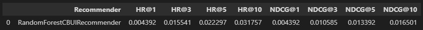
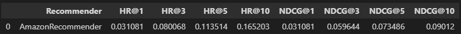
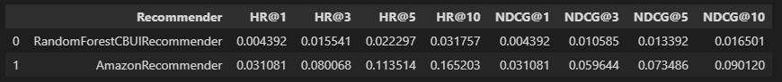

# Recommender Class Project 1

### **Project description**
 This project is recommender based on recommenders included in classes. 
 
 The goal was to train recommender and achieve the best score and compare it to Amazon recommender.

 Recommenders use data from real hotel company.

 Project contains 2 the most important files: 
-  project_1_data_preparation.ipynb
-  project_1_recommender_and_evaluation.ipynb

 Other files are important to properly run everything.

 ### **Necessery libraries for this project to run:**
 - numpy
 - pandas
 - matplotlib
 - seaborn
 - sklearn
 - hyperopt
 - traceback

 To install libraries mentioned above use:

    pip install <name_of_package>

 **You also need program to open .ipynb files.**
 
 Recommended is [Visual Studio Code](https://code.visualstudio.com/download) with Python 3.8.

 ### **Description of key parts of project**

1. project_1_data_preparation.ipynb:
    
    This notebook contains several methods to prepare data for recommender.

    It uses functions stored in **data_preprocessing\data_preprocessing_toolkit.py** to achieve final results for data.

    **This is important to run this notebook before project_1_recommender_and_evaluation.ipynb!**

2. project_1_recommender_and_evaluation.ipynb:

    This notebook contains methods to prepare user features and item features for recommender.

    **It uses processed data from project_1_data_preparation.ipynb**

    This file defines how recommender work. 
    
    It also tune params to achieve the best final score and compare different recommender types.

### **Final results**

 Effectiveness of recommenders was verified by algorithms stored in **evaluation_and_testing/evaluation_measures.py** and  **evaluation_and_testing/testing.py**.

 For recommender presented in this project results are:

For Amazon recommender results are:

So for both recommenders resluts are:

